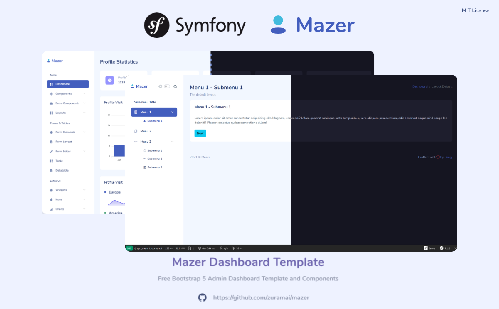

# symfony-mazer
[Symfony](https://symfony.com/) 6.2 PHP project (--webapp) boilerplate with `symfony/webpack-encore-bundle` and [Mazer Dashboard Template](https://github.com/zuramai/mazer) 2.0.3

Mazer is a Admin Dashboard Template that can help you develop faster. Made with Bootstrap 5. No jQuery dependency.

## Table of contents

- [Links](#links)
- [Requirements](#requirements)
- [Installation](#installation)
- [Documentation](#documentation)

## Links
- Mazer Demo: [zuramai.github.io/mazer/demo](https://zuramai.github.io/mazer/demo)
- Mazer Repository: [github.com/zuramai/mazer](https://github.com/zuramai/mazer)
- Symfony: [symfony.com](https://symfony.com)
- Twig BWExtension: [https://github.com/bocharsky-bw/ActiveMenuItemBundle/blob/master/src/Twig/BWExtension.php](https://github.com/bocharsky-bw/ActiveMenuItemBundle/blob/master/src/Twig/BWExtension.php)

## Requirements
- [PHP 8.1 or higher](https://www.php.net/manual/en/install.php)
- [Composer](https://getcomposer.org/download)
- [NodeJS](https://nodejs.org/en/download/) and [Yarn](https://classic.yarnpkg.com/en/) or [npm](https://docs.npmjs.com/downloading-and-installing-node-js-and-npm)
- Other Symfony requirements https://symfony.com/doc/current/setup.html#technical-requirements
- Optional: [Symfony CLI](https://symfony.com/download)

## Installation
- Download this repository or clone the repo
```
git clone https://github.com/jvl1v5/symfony-mazer.git
```
- Install PHP dependencies
```
composer install
```
- Install JS dependencies
```
yarn install
```
or
```
npm install
```
- Build packages

```
yarn build
```
or

```
npm run build
```

- Start Symfony (CLI) Dev Webserver
```
symfony serve
```
-  Open `http://localhost:8000`


## Documentation
The Symfony project was build with Symfony CLI
```
symfony new symfony-mazer --webapp
```
Complete Mazer 2.0.3 source files are at `./_resource/mazer-src` for documentation purposes.  
Content of Mazer assets source folder `mazer-src/assets` were copied to `./assets/mazer`.  
Mazer imports are defined in `./assets/app.js` and `./assets/styles/app.scss`.  
Add Mazer JS components needed to `./assets/app.js` and run `yarn build`.  


### Twig Filter / Function for navigation
For dynamically adding / removing the `current` and `active` css classes in the navigation menu there is a Twig filter extension.

The file is `./srv/Twig/TwigFilterExtension.php` which ist based on https://github.com/bocharsky-bw/ActiveMenuItemBundle/blob/master/src/Twig/BWExtension.php.

There is a Twig filter `{{ 'route.name'|is_active }}` and a Twig function `{{ is_active('route.name') }}`.

The filter compares the given route name against the route of the current / active page.  
The optional `lazyCheck` parameter of the Twig function `{{ is_active('route.name', true) }}` is only needed for complex routes which will be shown in an advanced boilerplate.

There is a `RootController` class with some controller methods and route attributes.  
The navigation menu can be found in `./src/templates/_sidebar.html.twig`


### Separate CSS/SCSS files for layouts/pages
For some pages or base-layouts like error or login/auth pages Mazer defines different CSS files.
To get this working there is some logic in `./templates/base.html.twig`.
You have to define a `base-layout` variable in the twig templates above the `extend` command.

If you need further Mazer CSS/SCSS files (from the layouts/pages folders) which have to be referenced separately,
add them as entrypoints (`.addEntry`) to the `./webpack.config.js` file and use them in the `./templates/base.html.twig` file
with `encore_entry_link_tags`.

Please note that you only have to add CSS/SCSS files this way which can't be used with the other / default files.  
E.g. if you use `./assets/mazer/scss/app.scss` and `./assets/mazer/scss/themes/dark/app-dark.scss` you can't use
`./assets/mazer/scss/pages/auth.scss` as well (some combinations break some stylings). You have to ensure that only `app.scss`and
`auth.scss`are loaded and not `app-dark.scss`. Take a look at `./templates/base.html.twig` and `./templates/bundles/TwigBundle/Exception/error404.html.twig`
to see how it works (with `error.scss` in this case) and extend the logic as needed. 